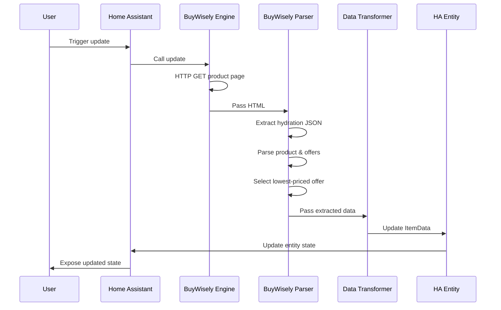

# BuyWisely Service Sequence & Data Flow Diagram

This document describes the end-to-end sequence and data flow for the BuyWisely service integration in the price_tracker component. It is intended to make the implementation and debugging process fool-proof.

---

## 1. Sequence Diagram (Textual)

1. **User/Automation** triggers a price update for a BuyWisely product entity in Home Assistant.
2. **Home Assistant** calls the BuyWisely integration's update method.
3. **BuyWisely Engine**:
    - Receives the product URL.
    - Makes an HTTP GET request to the BuyWisely product page.
4. **BuyWisely Parser**:
    - Extracts the Next.js hydration JSON from the HTML.
    - Parses the hydration data to locate the `product` dictionary.
    - Traverses the `offers` list within `product`.
    - Selects the lowest-priced offer (ignoring zero-priced offers). If all current offers are zero-priced, an exception is raised.
    - Extracts its `seller_product_url`.
    - Logs the full hydration data, offers list, all candidate URLs, and extraction diagnostics.
5. **Data Transformer**:
    - Maps the extracted product and offer data to the `ItemData` model.
    - Sets the entity `url` to the selected `seller_product_url`.
6. **Home Assistant Entity**:
    - Updates the entity state and attributes with the new data.
    - Logs the final state and any errors.
7. **User/Automation**:
    - Reads the updated entity state and diagnostics via the Home Assistant UI or API.

---

## 2. Data Flow Diagram (Textual)

```
[User/Automation]
      |
      v
[Home Assistant Entity Update Trigger]
      |
      v
[BuyWisely Engine]
      |
      v
[HTTP GET BuyWisely Product Page]
      |
      v
[BuyWisely Parser]
      |
      v
[Extract Hydration JSON]
      |
      v
[Parse Product & Offers]
      |
      v
[Select Lowest-Priced Offer]
      |
      v
[Data Transformer]
      |
      v
[ItemData Model]
      |
      v
[Home Assistant Entity State]
      |
      v
[User/Automation]
```

---

## 3. Key Data Transformations
- HTML → Hydration JSON
- Hydration JSON → Product dict
- Product dict → Offers list
- Offers list → Lowest-priced offer
- Lowest-priced offer → `seller_product_url`
- All extracted data → `ItemData` model
- `ItemData` → Home Assistant entity state

---

## 4. Error & Diagnostics Flow
- At each step, log input, output, and errors.
- If offers list is missing/empty, log and set entity `url` to empty.
- If lowest-priced offer is missing `seller_product_url`, log and set entity `url` to empty.
- If a zero-priced offer is encountered, log it as an extraction bug and ignore it. If all offers are zero-priced, log and raise an exception.
- All logs must be accessible via the Home Assistant log file.

---

## 5. Visual Diagram (Mermaid Syntax)



---

This diagram must be updated if the BuyWisely integration flow or data contract changes.